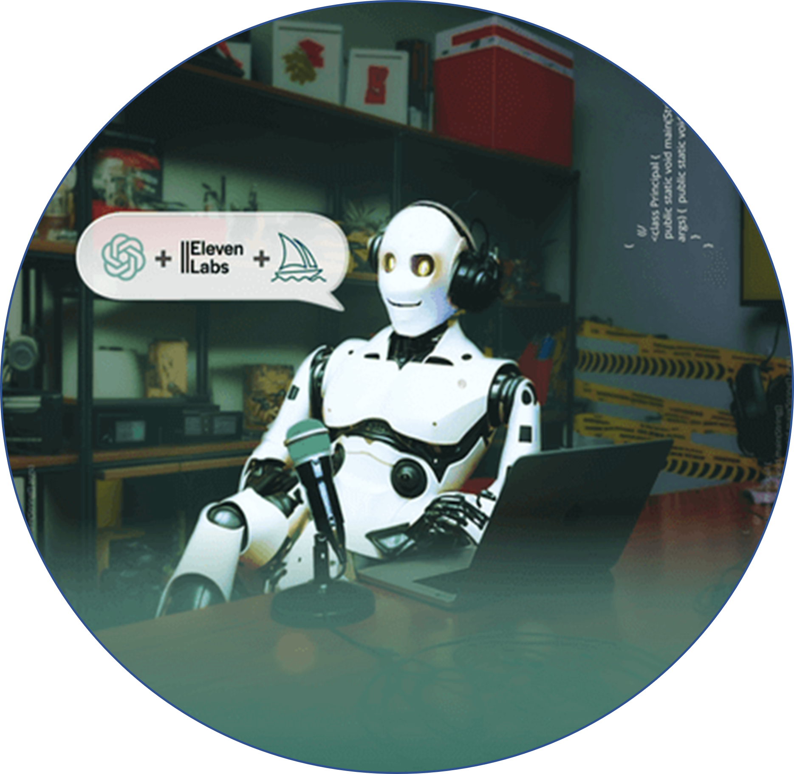

    preview do podcast

    <audio src="output/podcast_editado.MP3" controls title="Podcast editado"></audio>

# Projeto Podcast Gerado por I.A.s

> ℹ️ **NOTE:** Este é o repositório desenvolvido durante uma live no Youtube em parceria com a [DIO](https://dio.me)

Projeto com o objetivo de gerar um podcast utilizando ferramentas de IA através de prompts mais trabalhado.

Utilizer uma esteira de prompts para gerar cada etapa do processo criativo.

## 💻 Tecnologias utilizadas no projeto

- [ChatGPT](https://chat.openai.com/)
- [Gemini](https://gemini.google.com/app?hl=pt-BR)
- [ElevenLabs](https://beta.elevenlabs.io/)
- [Wondershare Filmora](https://www.wondershare.com.br/)

## ✨ Como foi feito ?

- Roteiro gerado via chatgpt
- Audio gerado pela elevenLabs
- Gemini e ChatGPT Para gerar capas
- Wondershare Filmora para tratar aúdio e adicionar sons de fundo

## 📚 Materiais

- [Link da live no Youtube](https://www.youtube.com)
- [Notion Template](https://www.notion.so/PAS-Podcast-AI-Studio-28574907b45080c58d23f187f8ad0596)
- [Editor de aúdio](https://www.wondershare.com.br/)

## 🛠️ Instruções de execução

Utilize os prompts dentro do link do `Notion` fornecido na parte de `Materiais` para criar um podcast de maneira automatizada, para isso siga o passo a passo abaixo.

- 🤖 1. Use os prompts de roteiro no `chagpt`
- 🤖 2. Use os prompts de roteiro gerados pelo chatgpt no `ElevenLabs`
- 🤖 3. Use os prompts de artes no `Gemini` ou se tiver dinheiro `midjourney`

## 👨‍💻 Feito Por

    
    <>&nbsp&nbsp&nbspLuan Dias 
    &nbsp&nbsp&nbsp
    <a 
        href="https://github.com/luandias19">
        GitHub
    </a>
    &nbsp;|&nbsp;
    <a 
        href="www.linkedin.com/in/luandias19">
        LinkedIn
    </a>
    &nbsp;|&nbsp;

  

---

⌨️ com 💜 por [Luan M. Dias](https://github.com/luandias19)
